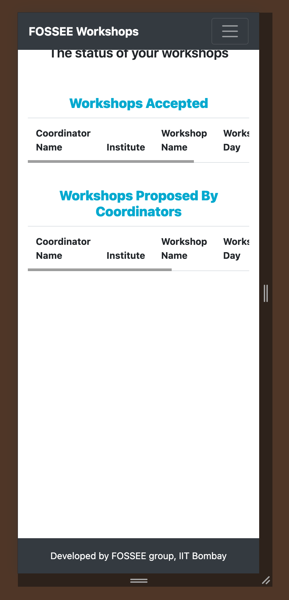
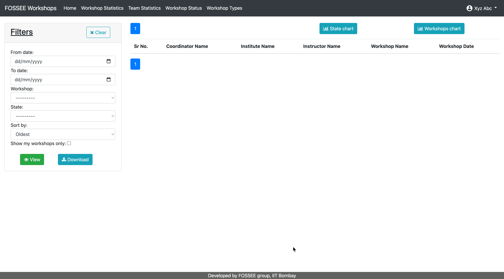
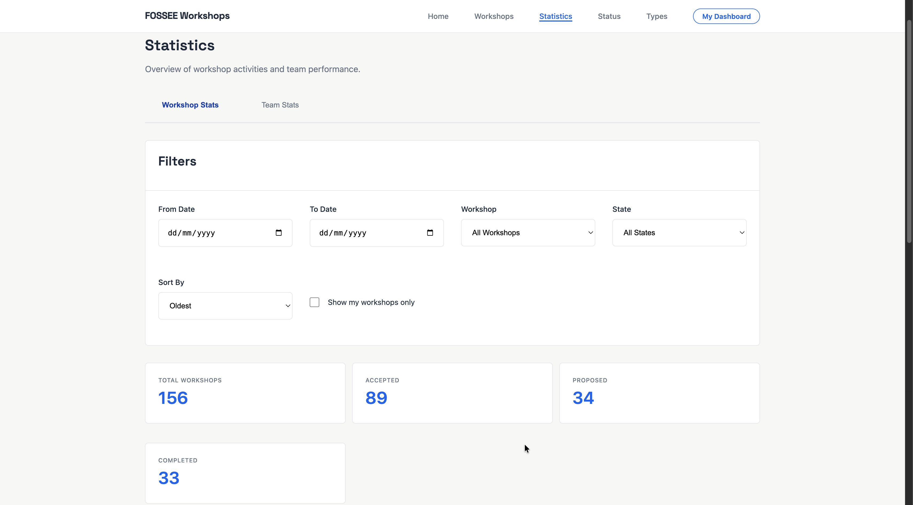
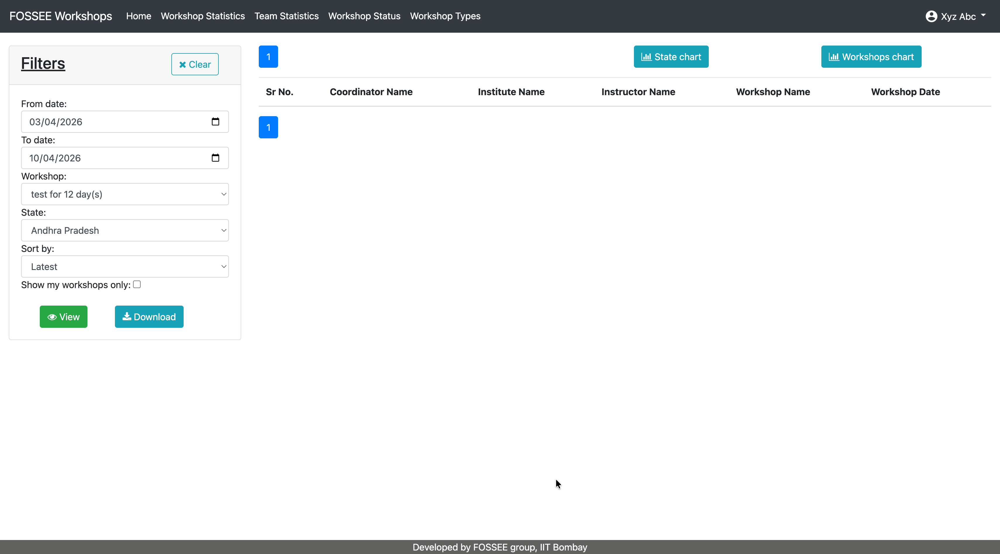
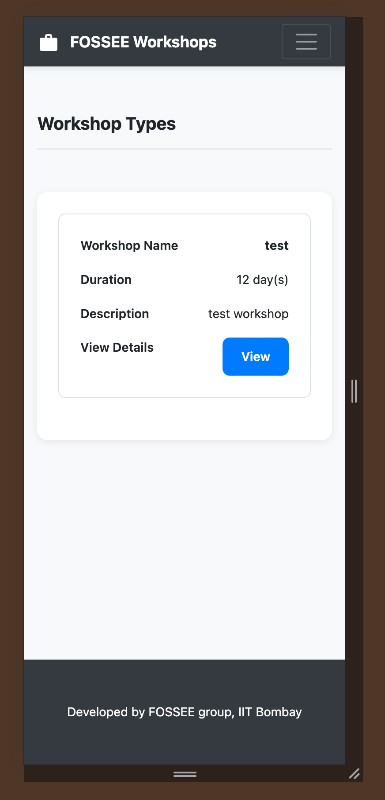
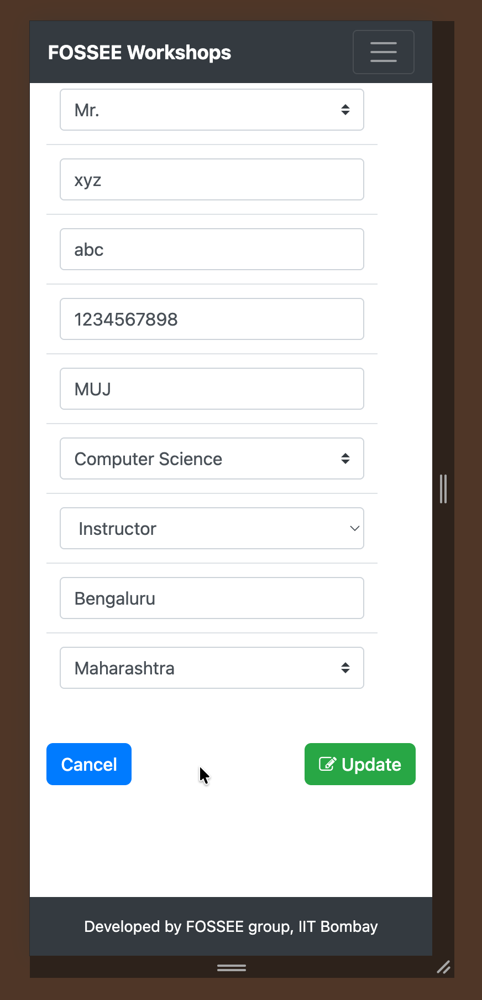
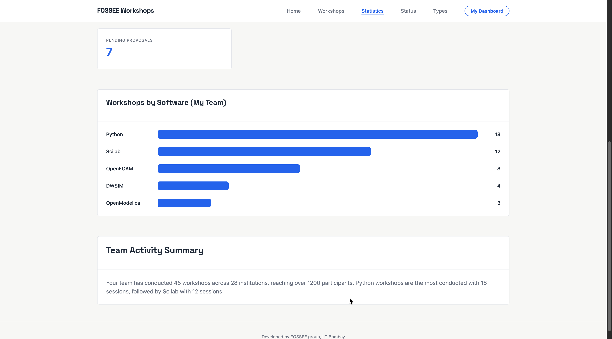
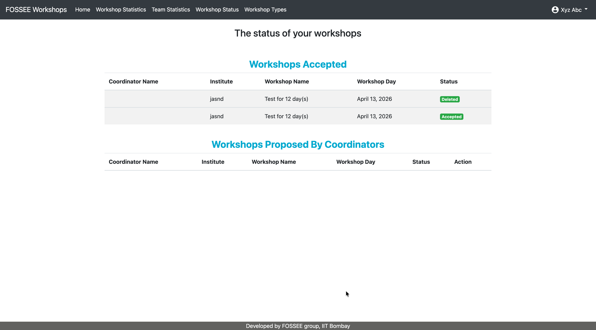
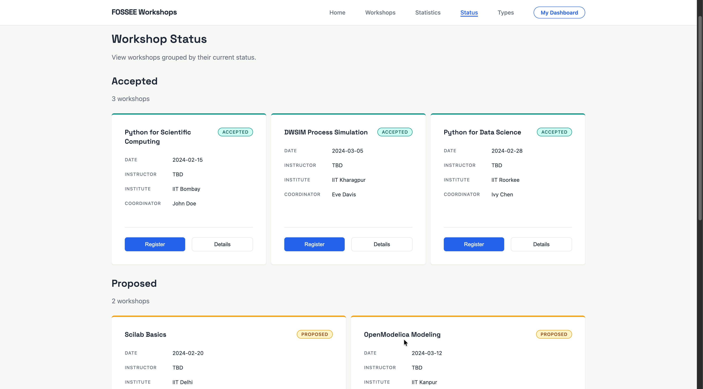

# FOSSEE Workshops

This branch sits between the other two. The ui-responsive branch only fixed broken things and made the layout work on mobile without touching the design. The ui-modernization branch went the other direction and did a full visual overhaul. This branch is the middle ground. The UI is not being rebuilt but it is being refined. Things like button tap targets, card visual hierarchy, spacing consistency, and small layout improvements make the site feel more polished and easier to use without changing what it fundamentally looks like. The goal was optimization and refinement, not redesign.

## Demo

<!-- Add your screen recording here -->

## Setup

Clone the repo and set up the Django environment:

```bash
git clone https://github.com/jayanthwritescode/workshop_booking.git
cd workshop_booking
python -m venv venv
source venv/bin/activate
pip install -r requirements.txt
python manage.py runserver
```

The Django development server will start on port 8000.

## What this branch does

The card layout was improved to give better visual weight to important information. Titles and metadata now have clearer hierarchy so users can scan workshop cards more quickly. Spacing was made consistent across all pages so nothing feels crowded or disconnected. Small layout adjustments were made to ensure elements align properly and the page structure feels intentional.

Button tap targets were made larger so they are easier to use on touch devices. Focus states were improved so keyboard navigation is more obvious. Interaction feedback was added so users know when something is clickable or selected. Some performance improvements were made like memoizing components to avoid unnecessary re-renders when data has not changed.

## My approach

I decided not to do a full redesign because that was already covered in the ui-modernization branch. The line was drawn at changing the fundamental look of the site. Changes were kept minimal and targeted to only things that improved usability or polish without changing the visual identity. The hardest part was deciding what counted as refinement versus redesign because the line can get blurry. The trade-off was that some things might not be perfect but the site feels more polished without losing its original character.

## Before and After

| Before | After |
| --- | --- |
|  |  |
|  |  |
|  |  |
|  |  |
|  |  |

## Submission Checklist

- [x] Code is readable and well-structured
- [x] Git history shows progressive work (no single commit dumps)
- [x] README includes reasoning answers and setup instructions
- [x] Screenshots or live demo link included
- [x] Code is documented where necessary
